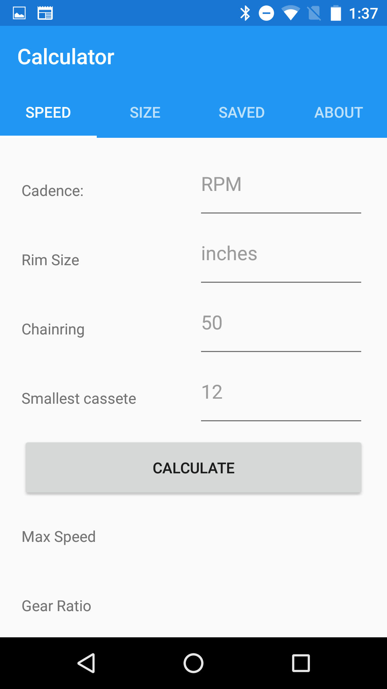

  

<b>Android | iOS</b>

## What's BikeHelper?
BikeHelper helps cyclists to find their perfect bicycle. You can calculate speed, write down names/prices and calculate ideal frame size.

## Why Xamarin.Forms?
We chose Xamarin.Forms because we wanted to use the same code for both Android and iOS. 

Xamarin.Forms is a powerful framework for creating cross platform applications using .Net. It provides means to write application logic and user interfaces that can be shared across platforms.

### Team members:
### Robert Shevchenko, Kertu Kipper, Grete Ojavere, Norman Salong, Kert Tamm

### Task Division (Android | iOS Version)
#### (x in square if done) 
- [x] Bike Gear Ratio Calculator (Robert)
- [x] Max Speed Calculator (Norman)
- [x] Bike Fitment Calculator (Kertu)
- [x] Save Bikes with Prices (Grete)
- [x] Create Splash Screen (Kert)
- [x] Create App Icons (Kert)
- [x] Write Readme.md (Kert)
- [ ] Test on iOS device (Kertu)

## Screenshots

